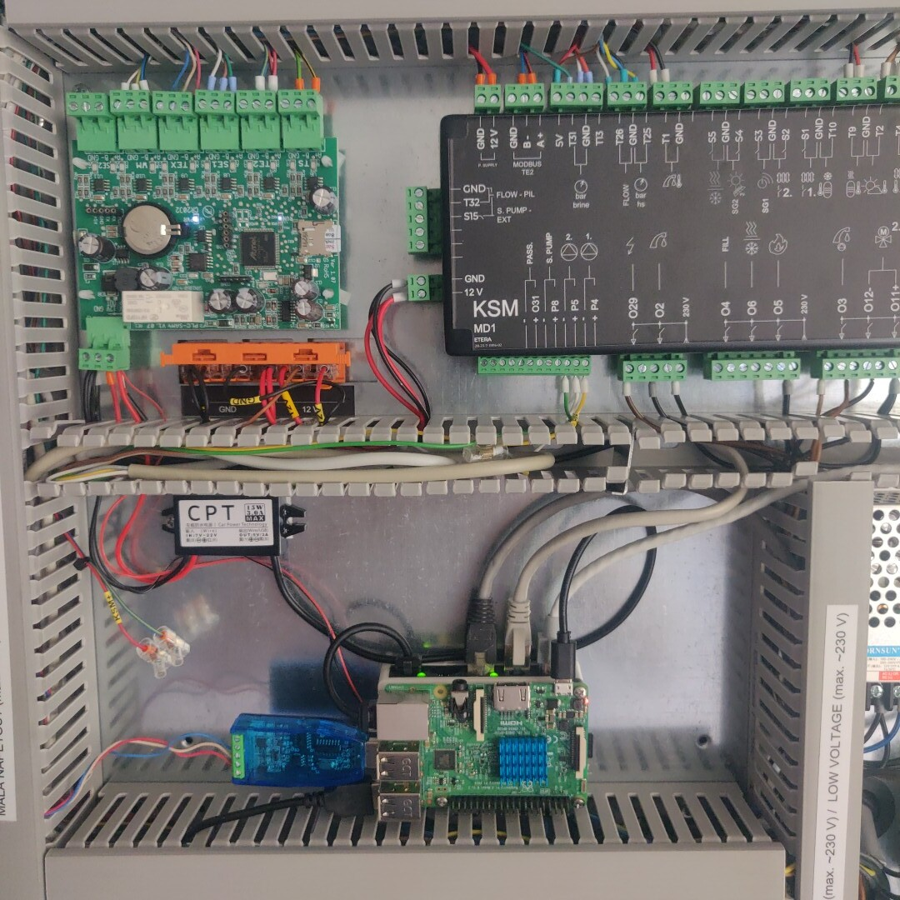
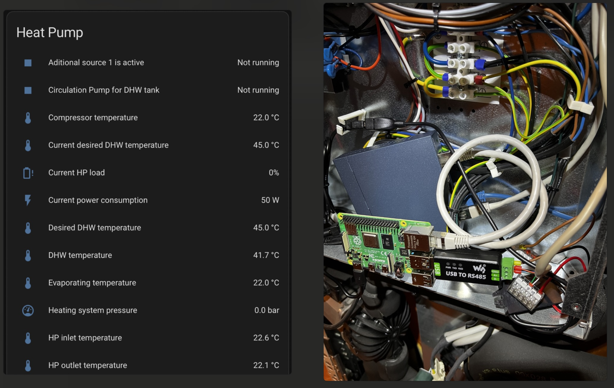
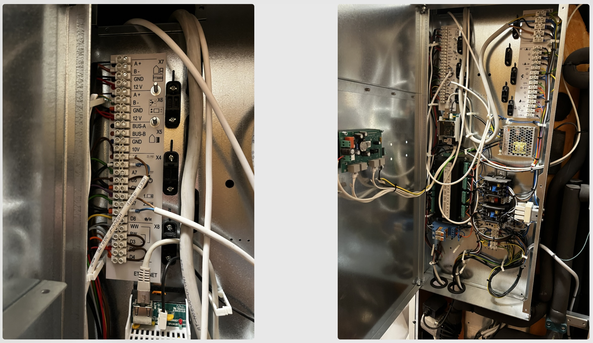
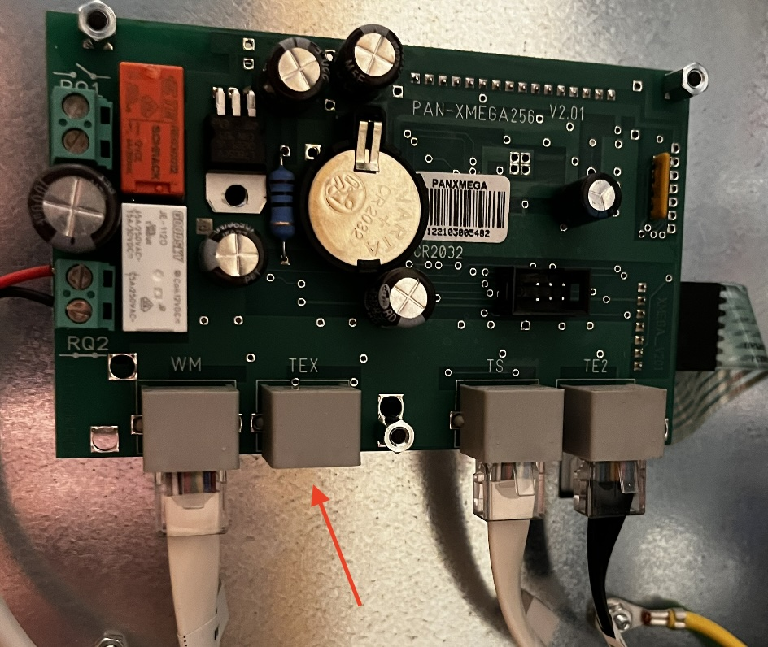
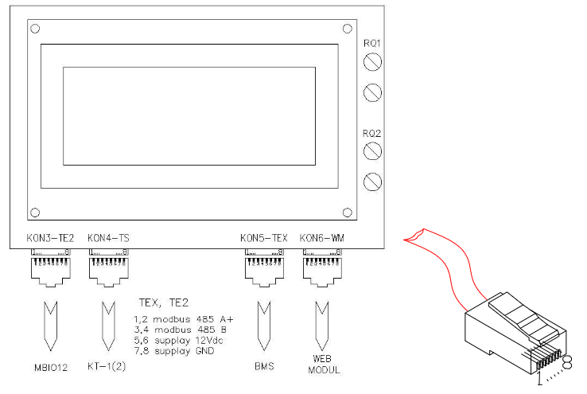
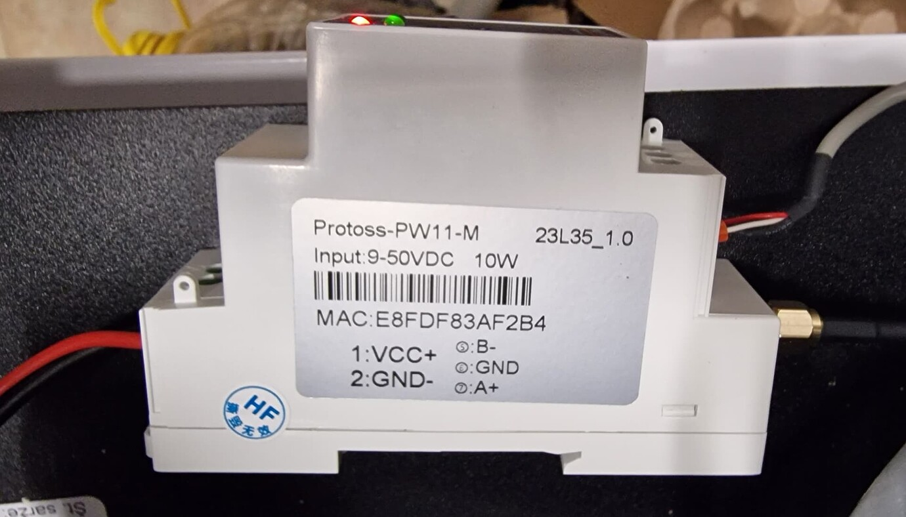
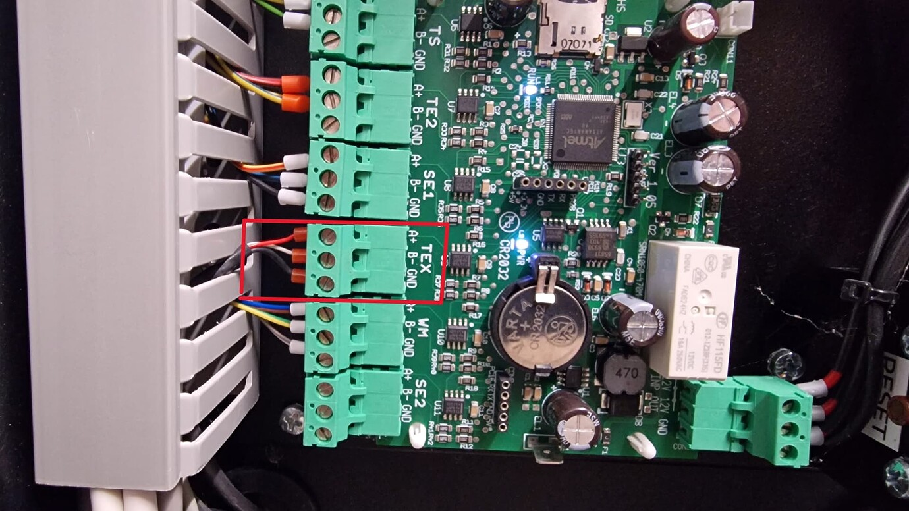
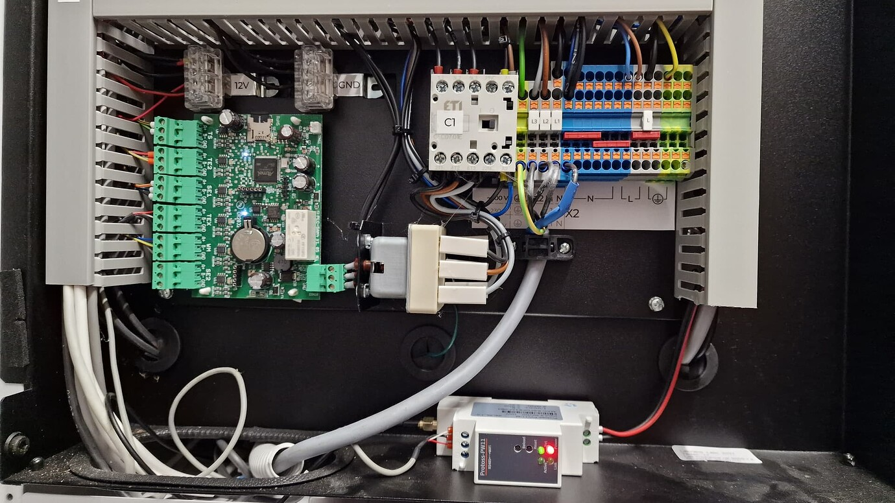
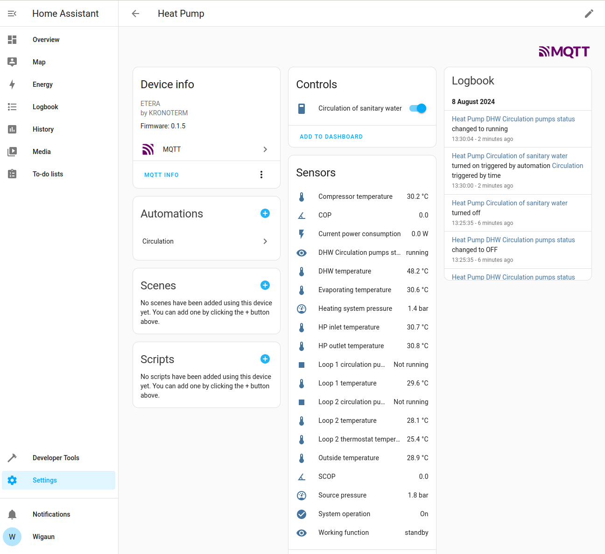
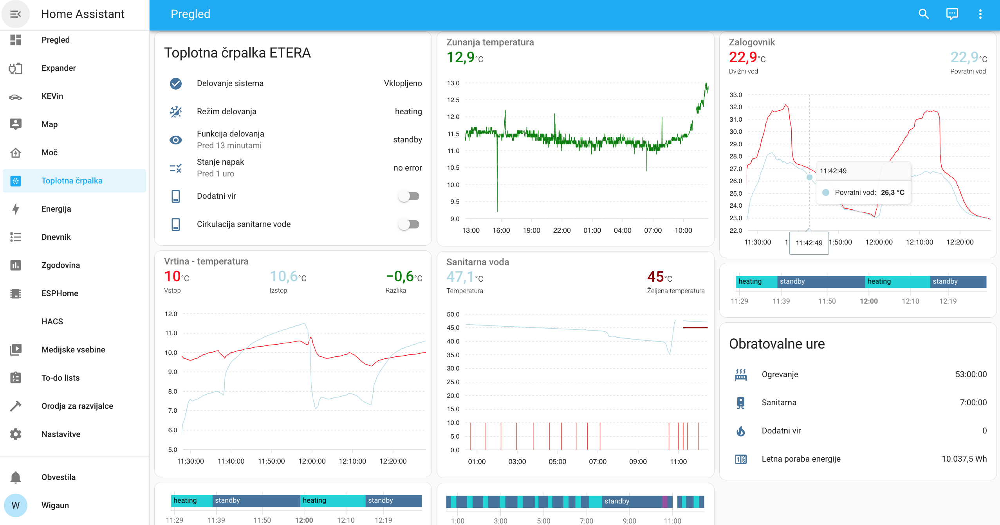

# kronoterm2mqtt

[](https://github.com/kosl/kronoterm2mqtt/actions/workflows/tests.yml)
[](https://app.codecov.io/github/kosl/kronoterm2mqtt)
[](https://pypi.org/project/kronoterm2mqtt/)
[](https://pepy.tech/projects/kronoterm2mqtt)
[](https://github.com/kosl/kronoterm2mqtt/blob/main/pyproject.toml)
[](https://github.com/kosl/kronoterm2mqtt/blob/main/LICENSE)

Kronoterm Heat Pump -> Modbus -> RS485-USB-Adapter -> kronoterm2mqtt -> MQTT -> Home Assistant

or

Kronoterm Heat Pump -> Modbus -> Modbus/TCP module -> kronoterm2mqtt -> MQTT -> Home Assistant


Gets information from a Kronoterm heat pump connected to Modbus TEX
interface. While this should work for all Kronoterm heat pumps the
software was verified to run on ETERA ground source heat pump with
Heat pump manager V3.13-1 and WPG-10-K2 HT ground source heat pump
with Heat pump manager V2.12-1 (19200 baud rate).  From the Kronoterm
modbus specification the registers are the same for all Kronoterm heat
pumps.

While reading Modbus registers from the pump the kronoterm2mqtt sends
MQTT discovery events from KRONOTERM to MQTT broker (Mosquito) that
Home Assistant then reads and the sensor readings appear therein
automatically.

Optionally, the MQTT loop can also control custom (DIY) IO expander to
be added to heat pump controlling additional heating loops and pumps
for solar DHW pre-heat boiler. This expander board is using Arduino
nano MCU to provide serial (UART) interface for Raspberry Pi
control. See [Etera UART GPIO expander
project](https://github.com/Lenart12/etera-uart-bridge) for help on
the protocol and interface. By default, this module functionality is
disabled so that only Kronoterm Heat Pump MQTT can still be used
without having this hardware module.

## Bootstrap kronoterm2mqtt

Clone the sources and just call the CLI to create a Python Virtualenv, e.g.:

```bash
~$ git clone --recursive https://github.com/kosl/kronoterm2mqtt.git
~$ cd kronoterm2mqtt
~/kronoterm2mqtt$ ./cli.py --help
```
The output of `./cli.py --help` looks like:

[comment]: <> (✂✂✂ auto generated main help start ✂✂✂)
```
usage: ./cli.py [-h] {edit-settings,print-registers,print-settings,print-values,probe-usb-ports,publish-loop,systemd-debug,systemd-remove,systemd-setup,systemd-status,systemd-stop,test-mqtt-connection,version}


╭─ options ───────────────────────────────────────────────────────────────────────────────────────────────────╮
│ -h, --help                show this help message and exit                                                   │
╰─────────────────────────────────────────────────────────────────────────────────────────────────────────────╯
╭─ subcommands ───────────────────────────────────────────────────────────────────────────────────────────────╮
│ (required)                                                                                                  │
│   • edit-settings         Edit the settings file. On first call: Create the default one.                    │
│   • print-registers       Print RAW modbus register data                                                    │
│   • print-settings        Display (anonymized) MQTT server username and password                            │
│   • print-values          Print all values from the definition                                              │
│   • probe-usb-ports       Probe through the USB ports and print the values from definition                  │
│   • publish-loop          Publish KRONOTERM registers to Home Assistant MQTT                                │
│   • systemd-debug         Print Systemd service template + context + rendered file content.                 │
│   • systemd-remove        Remove Systemd service file. (May need sudo)                                      │
│   • systemd-setup         Write Systemd service file, enable it and (re-)start the service. (May need sudo) │
│   • systemd-status        Display status of systemd service. (May need sudo)                                │
│   • systemd-stop          Stops the systemd service. (May need sudo)                                        │
│   • test-mqtt-connection  Test connection to MQTT Server                                                    │
│   • version               Print version and exit                                                            │
╰─────────────────────────────────────────────────────────────────────────────────────────────────────────────╯
```
[comment]: <> (✂✂✂ auto generated main help end ✂✂✂)

## Setup

Once having hardware (Modbus RS485 wiring or Modbus/TCP module) correctly installed the steps to get running are:

1. `./cli-app.py edit-setting` to configure MQTT host and credentials, heat pump model and port.
2. `./cli-app.py test-mqtt-connection` to check that Mosquitto broker accepts connections.
4. `./cli-app.py print-values` to see the actual registers from the heat pump converted to correct units.
3. Install and configure MQTT integration in Home assistant
4. `./cli-app.py publish-loop` to see the heat pump under Home Assistant -> Settings -> Devices & Services -> MQTT.
5. `sudo ./cli-app.py systemd-setup` to create permanent service (enable) and (re-)start it
6. `sudo ./cli-app.py systemd-status` to see the `kronoterm2mqtt.service` status

There are some other useful commands to debug (`-v` switch) and
develop it further. Unwanted registers can be commented out by
changing `kronoterm2mqtt/definitions/kronoterm_ksm.toml` individual
`[[sensor]]` entries to something like `[[sensor_disabled]]` so that
it will be skipped during definitions scan. There are quite some
number of disabled sensors that can be shown and the TOML file can get
more sensors if required. Note that you need to have at least one of
each sensor type enabled in your TOML file (`[[enum_sensor]]`,
`[[sensor]]]`, `[[binary_sensor]]`). Controls (`[[switch]]`,
`[[select]]`) are optional and can be disabled completely.

Note: It's a good idea to use the `/dev/serial/by-path/{your-device-id}`
path as serial port, instead of `/dev/ttyUSB1`
Call `udevadm info -n /dev/ttyUSB*` to get information about all USB
serial devices and `ls -l /dev/serial/by-path/` to see the existing links.

### print-values
```sh
./cli.py print-values

+ /home/leon/kronoterm2mqtt/.venv-app/bin/kronoterm2mqtt_app print-values

kronoterm2mqtt v0.1.8 ab9d6f5 (/home/leon/kronoterm2mqtt)
Connect to /dev/ttyUSB0...
       Desired DHW temperature 45.0 °C
Current desired DHW temperature 45.0 °C
Loop 1 temperature offset in ECO mode -6550.7 °C
          HP inlet temperature 30.5 °C
               DHW temperature 52.3 °C
           Outside temperature 33.6 °C
         HP outlet temperature 31.0 °C
       Evaporating temperature 30.9 °C
        Compressor temperature 30.4 °C
     Current power consumption 0.0 W
            Loop 1 temperature 30.8 °C
            Loop 2 temperature 28.7 °C
 Loop 2 thermostat temperature 25.4 °C
       Heating system pressure 1.4 bar
               Current HP load 0 %
               Source pressure 1.8 bar
                          SCOP 0.00 
```

## Using PyPi repository

*kronoterm2mqtt* is released under PyPi so that it is easier to
install it in a virtual environment such as:

```sh
python3 -m venv venv
venv/bin/pip install kronoterm2mqtt
venv/bin/kronoterm2mqtt_app edit-settings
venv/bin/kronoterm2mqtt_app print-values
```

## Docker

kronoterm2mqtt can run inside a Docker container. This is useful when you don't want to install Python dependencies on the host or when deploying on a server without direct USB access (e.g. using Modbus/TCP).

### Quick start

```bash
git clone --recursive https://github.com/kosl/kronoterm2mqtt.git
cd kronoterm2mqtt
```

Create your configuration at `config/kronoterm2mqtt.toml` (see [Setup](#setup) for details), then:

```bash
docker compose up -d
```

### Configuration

The `docker-compose.yml` mounts `./config` into the container as the settings directory. Place your `kronoterm2mqtt.toml` there before starting.

To edit settings interactively inside the container:

```bash
docker compose run --rm kronoterm2mqtt edit-settings
```

### Testing MQTT connection

```bash
docker compose run --rm kronoterm2mqtt test-mqtt-connection
```

### MQTT TLS

To use TLS for MQTT, place your certificate files under `config/certs/` and configure `[mqtt_tls]` in your TOML settings:

```toml
[mqtt]
host = "mqtt.example.com"
port = 8883
user_name = "myuser"
password = "mypassword"

[mqtt_tls]
enabled = true
ca_certs = "/certs/ca.crt"
certfile = "/certs/client.crt"
keyfile = "/certs/client.key"
```

The `docker-compose.yml` mounts `./config/certs` to `/certs` inside the container.

### Serial devices (Modbus RTU)

If using a USB RS485 adapter, uncomment the `devices` section in `docker-compose.yml`:

```yaml
devices:
  - /dev/ttyUSB0:/dev/ttyUSB0
```

### Viewing logs

```bash
docker compose logs -f
```

## Derived sensors (helpers) in Home Assistant

If we are interested in some additional info derived from the heat
pump then it is useful to add some derived sensors. The following
example calculates difference between source inlet and outlet
(evaporating and compressor) temperatures.

### Temperature calculation
In Homeassistant select Settings -> Devices -> Helpers -> + Add Helper
-> Template -> Template a Sensor and enter

- Name: Heat Pump Source temperature difference
- State template:
 ~~~ javascript
 {{ states('sensor.heat_pump_evaporating_temperature')|float(default=0)
 - states('sensor.heat_pump_compressor_temperature')|float(default=0) }}
 ~~~
- Unit of measurement: C
- Device class: Temperature
- State class: Measurement
- Add this helper under Heat Pump

### Energy calculation

### Power integration over time

Integral of power is energy consumend.

- Select Settings -> Devices -> Helpers -> + Add Helper-> Integral
- Name: Heat Pump Energy consumption
- Metric prefix: 
- Time unit: h
- Input Sensor: sensor.heat_pump_current_power_consumption
- Integration method: trapezoidal
- Add this helper under Heat Pump

### Yearly energy calculation

- [Add Utility Meter](https://www.home-assistant.io/integrations/utility_meter) integration
- Select Settings -> Devices -> Helpers -> + Add Helper-> Template 
- Name: Heat Pump Energy consumption (yearly reset)
- Input sensor: sensor.heat_pump_energy_consumption
- Meter reset cycle: yearly
- Meter reset offset: 0
- Add this helper under Heat Pump

## Images
### Modbus RTU connection within a Kronoterm ETERA heat pump from Raspberry Pi3B to TEX interface


Raspberry Pi3B (running Home Assistant) and a small 5-port ethernet
switch below are powered by a buckle step down (12->5V) converters.

### WPG-10-K2 HT




Note that bitrate needs to be changed to 19200 for WPG heat pumps within `[connection]` section.
~~~toml
~/kronoterm2mqtt/kronoterm2mqtt/definitions/kronoterm_ksm.toml

[connection]
#baudrate = 115200
baudrate = 19200
bytesize = 8
parity = "N"
stopbits = 1
~~~

### Adapt with Modbus/TCP WiFi module
Example Modbus/TCP Wifi module such as [Protoss PW11](http://www.hi-flying.com/pw11).
Search online for Modbus Gateway TCP/IP to RTU.



Setting port as Host IP address or host name with optional :port selects
TCP client as in example below. Note that RTU settings are to be setup in the module web interface!
~~~toml
[heat_pump]
# The "definitions_name" is the prefix of "kronoterm2mqtt/definitions/*.toml" files!
definitions_name = "kronoterm_ksm"
device_name = "Heat Pump"
port = "192.168.1.112:502"
model = "ADAPT"
slave_id = 20
timeout = 0.5
~~~

### Home Assistant

Home Assistant -> Settings -> Devices & Services -> MQTT screenshot



Dashboard raw sources for above cards is under
[kronoterm2mqtt/examples/dashboard-overview.yaml](kronoterm2mqtt/examples/dashboard-overview.yaml).
It requires custom
[apexcharts-card](https://github.com/RomRider/apexcharts-card) to be
installed. Create new dashboard with Home Assistant -> Settings ->
Dashboard -> Add Dashboard and then Edit -> Edit raw sources.  While
the sensor names are in English, you may always rename the names to
your local language.

## Hardware wiring test

The connection to TEX port is done with RS485 dongle using 3 wires (A,
B, GND). The cheapest "USB to RS485 Converter" with GND will work when
connected to TEX (Modbus) port located in the Kronoterm heat pump
processor board (KSM). I recommend Raspberry Pi 3B+ with Home
Assistant to be used inside the heat pump. Otherwise, you will need to
have a long 3-wire twisted cable to it or use some Modbus/TCP module.
Before running `kronoterm2mqtt` it is advisable to run simple example
provided to debug and test the communication as shown below.

~~~sh
$ python3 -m venv venv
$ venv/bin/pip install pymodbus pyserial
$ venv/bin/python kronoterm2mqtt/examples/print-temperatures.py
2024-08-09 10:11:35,553 DEBUG logging:103 Current transaction state - IDLE
2024-08-09 10:11:35,554 DEBUG logging:103 Running transaction 1
2024-08-09 10:11:35,554 DEBUG logging:103 SEND: 0x14 0x3 0x8 0x34 0x0 0xa 0x84 0xa6
2024-08-09 10:11:35,555 DEBUG logging:103 Resetting frame - Current Frame in buffer - 
2024-08-09 10:11:35,556 DEBUG logging:103 New Transaction state "SENDING"
2024-08-09 10:11:35,557 DEBUG logging:103 Changing transaction state from "SENDING" to "WAITING FOR REPLY"
2024-08-09 10:11:35,579 DEBUG logging:103 Changing transaction state from "WAITING FOR REPLY" to "PROCESSING REPLY"
2024-08-09 10:11:35,579 DEBUG logging:103 RECV: 0x14 0x3 0x14 0x1 0x20 0x1 0xe3 0x0 0xf7 0x1 0x25 0x1 0x2f 0x1 0x2a 0xfd 0xa8 0x0 0x0 0xfd 0xa8 0x1 0xc 0x8d 0x77
2024-08-09 10:11:35,580 DEBUG logging:103 Processing: 0x14 0x3 0x14 0x1 0x20 0x1 0xe3 0x0 0xf7 0x1 0x25 0x1 0x2f 0x1 0x2a 0xfd 0xa8 0x0 0x0 0xfd 0xa8 0x1 0xc 0x8d 0x77
2024-08-09 10:11:35,580 DEBUG logging:103 Getting Frame - 0x3 0x14 0x1 0x20 0x1 0xe3 0x0 0xf7 0x1 0x25 0x1 0x2f 0x1 0x2a 0xfd 0xa8 0x0 0x0 0xfd 0xa8 0x1 0xc
2024-08-09 10:11:35,580 DEBUG logging:103 Factory Response[ReadHoldingRegistersResponse': 3]
2024-08-09 10:11:35,581 DEBUG logging:103 Frame advanced, resetting header!!
2024-08-09 10:11:35,581 DEBUG logging:103 Adding transaction 0
2024-08-09 10:11:35,581 DEBUG logging:103 Getting transaction 0
2024-08-09 10:11:35,581 DEBUG logging:103 Changing transaction state from "PROCESSING REPLY" to "TRANSACTION_COMPLETE"
KRONOTERM Temperatures: ['28.8°C', '48.3°C', '24.7°C', '29.3°C', '30.3°C', '29.8°C', '6493.6°C', '0.0°C', '6493.6°C', '26.8°C']
~~~
If the test above fails, try to change port or baudrate to 19200 by editing `kronoterm2mqtt/examples/print-temperatures.py`.


## Systemd with Mosquitto in Docker

To cleanly start at boot without restarts one may need to wait a while
by probing the port until available with additional setup for
`localhost` Mosquitto to serve. Updated
`/etc/systemd/system/kronoterm2mqtt.service` should look like

~~~systemd
[Unit]
Description=kronoterm2mqtt
After=syslog.target network.target docker.service 

[Service]
User=kronoterm
Group=kronoterm
WorkingDirectory=/home/kronoterm/kronoterm2mqtt
ExecStartPre=/bin/bash -c 'until </dev/tcp/localhost/1883; do sleep 1; done 2> /dev/null; sleep 20'
ExecStart=/home/kronoterm/kronoterm2mqtt/.venv-app/bin/kronoterm2mqtt_app publish-loop

Restart=on-failure
RestartSec=5s
SyslogIdentifier=kronoterm2mqtt

[Install]
WantedBy=multi-user.target
~~~

## TODO

- [x] `enum_sensor` to convert status registers to more meaningfull text readings instead of float sensor
- [x] `switch` to turn on at least DHW circulation pump manually in Home Assistant and then programatically since 6 transitions provided by the heat pump is too limited
- [x] `binary_sensor` to show some two-state states
- [x] `binary_sensor` to decode binary statuses in `enum` like manner combined. For example error messages or "additional activations".
- [ ] Upgrade [ha-services](https://github.com/jedie/ha-services) with `number` component allowing change of some numeric parameters (set temperatures, etc.).
- [ ] Display the heat pump state using ThermIQ as an example.
- [ ] Expander should full cycle mixing motors when DHW is working.
- [ ] Add save state to settings and sensors for computed reference temperatures
- [ ] Enable/disable heat pump switch.
- [ ] Add intertank pump switch

# dev CLI

[comment]: <> (✂✂✂ auto generated dev help start ✂✂✂)
```
usage: ./dev-cli.py [-h] {coverage,expander-loop,expander-motors,expander-relay,expander-temperatures,firmware-compile,firmware-flash,install,lint,mypy,nox,pip-audit,publish,test,update,update-readme-history,update-test-snapshot-files,version}


╭─ options ────────────────────────────────────────────────────────────────────────────────────────────────────────────╮
│ -h, --help     show this help message and exit                                                                       │
╰──────────────────────────────────────────────────────────────────────────────────────────────────────────────────────╯
╭─ subcommands ────────────────────────────────────────────────────────────────────────────────────────────────────────╮
│ (required)                                                                                                           │
│   • coverage   Run tests and show coverage report.                                                                   │
│   • expander-loop                                                                                                    │
│                Runs Custom expander control of a solar pump                                                          │
│   • expander-motors                                                                                                  │
│                Rotates all 4 motors by closing (counterclockwise) or opening (clockwise) for duration seconds        │
│   • expander-relay                                                                                                   │
│                Switches on or off selected relay                                                                     │
│   • expander-temperatures                                                                                            │
│                Print temperatures read from Custom expander                                                          │
│   • firmware-compile                                                                                                 │
│                Compiles firmware for Etera GPIO expander with PlatformIO compiler                                    │
│   • firmware-flash                                                                                                   │
│                Flashes compiled firmware to Etera GPIO expander                                                      │
│   • install    Install requirements and 'kronoterm2mqtt' via pip as editable.                                        │
│   • lint       Check/fix code style by running: ruff check --fix"                                                    │
│   • mypy       Run Mypy (configured in pyproject.toml)                                                               │
│   • nox        Run nox                                                                                               │
│   • pip-audit  Run pip-audit check against current requirements files                                                │
│   • publish    Build and upload this project to PyPi                                                                 │
│   • test       Run unittests                                                                                         │
│   • update     Update dependencies (uv.lock) and git pre-commit hooks                                                │
│   • update-readme-history                                                                                            │
│                Update project history base on git commits/tags in README.md Will be exited with 1 if the README.md   │
│                was updated otherwise with 0. Also, callable via e.g.:                                                │
│                    python -m cli_base update-readme-history -v                                                       │
│   • update-test-snapshot-files                                                                                       │
│                Update all test snapshot files (by remove and recreate all snapshot files)                            │
│   • version    Print version and exit                                                                                │
╰──────────────────────────────────────────────────────────────────────────────────────────────────────────────────────╯
```
[comment]: <> (✂✂✂ auto generated dev help end ✂✂✂)


# History

[comment]: <> (✂✂✂ auto generated history start ✂✂✂)

* [**dev**](https://github.com/kosl/kronoterm2mqtt/compare/v0.1.16...main)
  * 2026-01-24 - Add switch for intertank pump
  * 2026-01-23 - More TODO notes
  * 2026-01-22 - Add motor duration for testing and TODO
  * 2026-01-22 - Correct Expander CLI to use constructor async
  * 2026-01-22 - Update requirements
  * 2026-01-22 - Update README
  * 2025-12-18 - Update libs
  * 2025-11-06 - Ignore starlette vulnerabilities
  * 2025-10-27 - Update uv
  * 2025-10-23 - Add ignore .log files
  * 2025-10-22 - Simpify scale as Decimal
  * 2025-10-22 - Correct decimal rounding for scaled sensor e.g. 132*0.1->13,2
  * 2025-10-05 - Ignore pip 15.2 audit GHSA-4xh5-x5gv-qwph problem
  * 2025-09-28 - Link to docs under issue #2
  * 2025-09-28 - Glued image of HASS screenshots
* [v0.1.16](https://github.com/kosl/kronoterm2mqtt/compare/v0.1.15...v0.1.16)
  * 2025-09-27 - Release 0.1.16
  * 2025-09-27 - Add a note on USB problem at exception
  * 2025-09-27 - Taskgroup correctly handles USB gliches
  * 2025-09-27 - Override motor move back again
  * 2025-09-27 - Add some wait time in order to USB adapter correctly restarts
  * 2025-09-27 - Move event loop to expander only and remove verbosity from args
  * 2025-09-26 - Add pooling interval to user settings
  * 2025-09-26 - device_class of enum is None
  * 2025-09-26 - Fix sensor value->state
  * 2025-09-25 - Update readme
  * 2025-09-25 - Taskgroup fails when ha_services == 2.10
* [v0.1.15](https://github.com/kosl/kronoterm2mqtt/compare/v0.1.14...v0.1.15)
  * 2025-09-26 - Fix enum validation and release new package
  * 2025-09-26 - Fix Invalid: device_class='enum' !
* [v0.1.14](https://github.com/kosl/kronoterm2mqtt/compare/v0.1.13...v0.1.14)
  * 2025-09-26 - Release 0.1.14
  * 2025-09-26 - Cleanup of the MQTT global device ids and components for running within a loop
  * 2025-09-25 - Note on systemd Mosquitto
  * 2025-09-25 - Add current heating power sensor
  * 2025-09-25 - Fix style
  * 2025-09-25 - Remove main retry loop since the component subscription can be duplicated somehow
  * 2025-09-25 - Upgrade to ha-services with Sensor.value -> Sensor.state change
  * 2025-09-25 - 0.1.13 release
  * 2025-09-24 - Add ADAPT images

<details><summary>Expand older history entries ...</summary>

* [v0.1.13](https://github.com/kosl/kronoterm2mqtt/compare/v0.1.12...v0.1.13)
  * 2025-09-24 - Fix indent
  * 2025-09-24 - Add Modbus/TCP client with WiFi module
  * 2025-09-24 - Add switch, select and fix binary sensor
  * 2025-09-24 - ruff format .
  * 2025-09-23 - Reintroduce platformio with ignored starlette 0.6.2 vulnerability
  * 2025-09-23 - Use ruff instead of darker
  * 2025-09-23 - Add unhandled exceptions to exit(1)
  * 2025-08-12 - Update for vulnerabilities
* [v0.1.12](https://github.com/kosl/kronoterm2mqtt/compare/v0.1.11...v0.1.12)
  * 2025-08-06 - Bump version for modbus change
  * 2025-08-06 - Upgrade to pymodbus 3.10
  * 2025-08-04 - Bump versions and disable plaformio (for now) to resolve pip-audit on starlette
  * 2025-06-22 - Fix vournerable library
* [v0.1.11](https://github.com/kosl/kronoterm2mqtt/compare/v0.1.10...v0.1.11)
  * 2025-06-06 - Fix comment
  * 2025-06-06 - Add release 1.11
  * 2025-06-06 - pip-tools -> uv
  * 2025-05-10 - Update print-temperatures.py
  * 2025-04-09 - Convert value to signed integer when printing
  * 2025-04-08 - Test for DS1820 parasitic or external power at start start
  * 2025-04-08 - Upgrade to latest pymodbus and other vulnerable libraries
  * 2025-04-08 - Align with updated firmware
  * 2024-12-16 - Fix standby mode for loops
  * 2024-12-16 - Protect solar collectors agains freezing below -13.45 degrees
  * 2024-12-16 - feat(expander): Add standby working mode
  * 2024-11-29 - Temporarily disable intertank logics
  * 2024-11-28 - feat(expander): Implement expedited heating
  * 2024-11-28 - refactor(expander): Convert heating loop on/off switch to multi-state working function select
  * 2024-11-17 - Fix parenthesis typo
* [v0.1.10](https://github.com/kosl/kronoterm2mqtt/compare/v0.1.9...v0.1.10)
  * 2024-11-15 - Add Downloads counter fix
  * 2024-11-15 - Add Downloads counter
  * 2024-11-15 - Revise python versions
  * 2024-11-15 - Negative scale handled by signed int conversion
  * 2024-11-15 - Upgrade and ignore starlette safety issues
  * 2024-11-15 - Handle all Modbus values as 16 bit signed integers to address negative temperatures
  * 2024-11-10 - Disabling solar collectors in settings now works with service restart
* [v0.1.9](https://github.com/kosl/kronoterm2mqtt/compare/v0.1.8...v0.1.9)
  * 2024-11-08 - Tune expander default for mix-valve control and upgrade virtualenv due to vulnerability ID: 73456
  * 2024-10-21 - Minor typos
  * 2024-10-19 - Add dashboard example with apexcharts cards
  * 2024-10-18 - Add WPG pump TOML example in Slovenian. Contributed by lukapple80
  * 2024-10-16 - Move settings outside exception loop
  * 2024-10-16 - Fix unused motor usage Motor #3 close invalid list index out of range
  * 2024-10-12 - Retry loop after 10 seconds in case of error
  * 2024-10-11 - WPG TEX pinout added
  * 2024-10-09 - Add mixing valves sensors
  * 2024-10-07 - Loop should be continued for all
  * 2024-10-07 - Close slightly the mixing valve already at the beginning of heating only
  * 2024-10-07 - Fix issue  Wrong operator used when calculating solar tank and dhw tank temperature delta #1
  * 2024-09-28 - Swap sensors for Pritličje and Mansarda
  * 2024-09-28 - Swap sensors for Nadgaražje and Mansarda
  * 2024-09-27 - Add bitrate and sensor notes
  * 2024-09-27 - Add WPG-10-K2_HT and Expander updates
  * 2024-09-27 - Add WPG-10-K2_HT photos and screens provided by Lukapple80
  * 2024-08-23 - Allow empty unit of measutement
  * 2024-08-23 - Add context manager to rescue from unexpected crashes by closing the UARTs before restart in a main loop
  * 2024-08-23 - update_sensors() is not needed fort clarity
  * 2024-08-19 - Rather use time.monotonic() to measure elapsed time difference
  * 2024-08-19 - Prefix main_uid to avoid conflicts with other ha_services
  * 2024-08-16 - Do not clear LSB for other sensors
  * 2024-08-13 - Udate minimum CLI requirements
  * 2024-08-13 - systemd-status fix
  * 2024-08-13 - systemd-setup does everything
  * 2024-08-13 - Add 0.1.8 MQTT screenshot
  * 2024-08-13 - Images inline
* [v0.1.8](https://github.com/kosl/kronoterm2mqtt/compare/v0.1.7...v0.1.8)
  * 2024-08-13 - Increase precission read of DS1820 to 1/128 degree Celsius
  * 2024-08-13 - Update to latest requirements
  * 2024-08-13 - Add intra-tank circulation
  * 2024-08-13 - Complete mixing valve motor control
  * 2024-08-12 - When moving with override the previous task raises exception which is normal
  * 2024-08-12 - Recursively clone
  * 2024-08-10 - Symlink pyetera_uart_bridge
  * 2024-08-09 - Create event loop without awaiting https://stackoverflow.com/questions/56318648/how-to-run-an-asyncio-task-without-awaiting
  * 2024-08-09 - Pass Loop 1 ECO mode offset and state to expander
  * 2024-08-09 - Add negative scaling sensors
  * 2024-08-09 - Add HP load as battery percentage
  * 2024-08-09 - Add expander loop switches
  * 2024-08-09 - Prepare heat pump values for use in expander
  * 2024-08-09 - Add hardware wiring test
* [v0.1.7](https://github.com/kosl/kronoterm2mqtt/compare/v0.1.6...v0.1.7)
  * 2024-08-08 - Add Alternative source switch and bit sensor
  * 2024-08-08 - Add Alternative source switch
* [v0.1.6](https://github.com/kosl/kronoterm2mqtt/compare/v0.1.5...v0.1.6)
  * 2024-08-08 - Fix CLI print-values
* [v0.1.5](https://github.com/kosl/kronoterm2mqtt/compare/v0.1.4...v0.1.5)
  * 2024-08-08 - Add switch for Circulation of sanitary water
  * 2024-08-08 - HA screenshot v0.1.5
  * 2024-08-07 - Add DHW pumps
  * 2024-08-07 - Add BinarySensor and Enum_sensors
  * 2024-08-07 - Add tests badge
* [v0.1.4](https://github.com/kosl/kronoterm2mqtt/compare/v0.1.3...v0.1.4)
  * 2024-08-07 - Prepare for 0.1.4 release
* [v0.1.3](https://github.com/kosl/kronoterm2mqtt/compare/v0.1.2...v0.1.3)
  * 2024-08-07 - Add print values to README
  * 2024-08-07 - Update deps
* [v0.1.2](https://github.com/kosl/kronoterm2mqtt/compare/9b1af4c...v0.1.2)
  * 2024-08-07 - Fix style
  * 2024-08-07 - Correct loop order according to http://cad.lecad.si/~leon/electronics/thermo/src/ds1820.asm.html
  * 2024-08-06 - Decode ETERA expander messages
  * 2024-08-05 - Countdown to verbosity
  * 2024-08-05 - Add control and bool moodule enable
  * 2024-08-04 - Add relays to Etera Sensors
  * 2024-08-03 - When a longer loop command is interrupted the subprocess task unwraps unnecessarily.
  * 2024-08-03 - Add manual control loop for solar pump
  * 2024-08-02 - Refrain from bool until https://github.com/jedie/cli-base-utilities/issues/50 is resolved
  * 2024-08-02 - Fix urls
  * 2024-08-02 - Upgrade API for pymodbus 3.7.0
  * 2024-08-02 - Add relays test
  * 2024-08-01 - Diagnose 1-wire with v1.0.8
  * 2024-07-31 - Move expander to DEV CLI
  * 2024-07-31 - Add firmware compile/flash DEV tools
  * 2024-07-31 - Add exander submodule
  * 2024-07-31 - Add expander temperatures print
  * 2024-07-31 - Convert loop to asyncio
  * 2024-07-29 - Comment out code style check due to timout=300 limit
  * 2024-07-27 - Add hardware photo
  * 2024-07-27 - Update README with some basic instructions
  * 2024-07-26 - Add Home assistant screenshot
  * 2024-07-26 - Add some undocumented registers
  * 2024-07-26 - Slugify uid
  * 2024-07-26 - Add missing device_class to Sensor
  * 2024-07-26 - Fix typo
  * 2024-07-26 - Reposition settings
  * 2024-07-26 - Add sensors to main device
  * 2024-07-26 - Add custom IO expander board
  * 2024-07-26 - Add reference
  * 2024-07-25 - Add Custom module source code
  * 2024-07-25 - Add ETERA expander module
  * 2024-07-24 - Initial version

</details>


[comment]: <> (✂✂✂ auto generated history end ✂✂✂)


## References

- [Navodila za priklop in uporabo CNS sistema.pdf](https://github.com/user-attachments/files/22581626/Navodila.za.priklop.in.uporabo.CNS.sistema.pdf) Kronoterm Modbus RTU description (in Slovene) obtained from Kronoterm support
- [Installation and Operating Manual for BMS System.pdf](https://github.com/user-attachments/files/17962066/Installation.and.Operating.Manual.for.BMS.System.pdf) Kronoterm Modbus V3.13-1 RTU description obtained from Kronoterm support
- [1122-16-17-4021-05_Modbus_BMS_TT3000web.pdf](https://github.com/user-attachments/files/17962067/22-16-17-4021-05_Modbus_BMS_TT3000web.pdf) Modbus naslovi za BMS; Regulacija TT3000 (in Slovene) obtained from Kronoterm support
