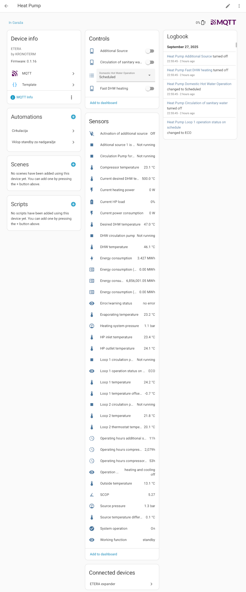

# kronoterm2mqtt

[](https://app.codecov.io/github/kosl/kronoterm2mqtt)
[](https://pypi.org/project/kronoterm2mqtt/)
[](https://github.com/kosl/kronoterm2mqtt/blob/main/pyproject.toml)
[](https://github.com/kosl/kronoterm2mqtt/blob/main/LICENSE)

Get information from the Kronoterm heat pump connected to Modbus TEX interface.

While reading Modbus registers from the pump the kronoterm2mqtt sends
MQTT discovery events from KRONOTERM to MQTT broker (Mosquito) that
Home Assistant then reads and the sensor readings appear therein
automatically.

Optionally, the MQTT loop can also control custom (DIY) IO expander to
be added to heat pump controlling additional heating loops and pumps
for solar DHW pre-heat boiler. This expander board is using Arduino
nano MCU to provide serial (UART) interface for Raspberry Pi
control. See [Etera UART GPIO expander
project](https://github.com/Lenart12/etera-uart-bridge) for help on
the protocol and interface. By default, this module functionality is
disabled so that only Kronoterm Heat Pump MQTT can still be used
without having this hardware module.

## Bootstrap kronoterm2mqtt

Clone the sources and just call the CLI to create a Python Virtualenv, e.g.:

```bash
~$ git clone --recursive https://github.com/kosl/kronoterm2mqtt.git
~$ cd kronoterm2mqtt
~/kronoterm2mqtt$ ./cli.py --help
```
The output of `./cli.py --help` looks like:

```sh
kronoterm2mqtt v0.1.3 bed9746 (/home/leon/kronoterm2mqtt)
                                                                                            
 Usage: ./cli.py [OPTIONS] COMMAND [ARGS]...                                                
                                                                                            
╭─ Options ────────────────────────────────────────────────────────────────────────────────╮
│ --help      Show this message and exit.                                                  │
╰──────────────────────────────────────────────────────────────────────────────────────────╯
╭─ Commands ───────────────────────────────────────────────────────────────────────────────╮
│ edit-settings         Edit the settings file. On first call: Create the default one.     │
│ print-registers       Print RAW modbus register data                                     │
│ print-settings        Display (anonymized) MQTT server username and password             │
│ print-values          Print all values from the definition                               │
│ probe-usb-ports       Probe through the USB ports and print the values from definition   │
│ publish-loop          Publish KRONOTERM registers to Home Assistant MQTT                 │
│ systemd-debug         Print Systemd service template + context + rendered file content.  │
│ systemd-remove        Remove Systemd service file. (May need sudo)                       │
│ systemd-setup         Write Systemd service file, enable it and (re-)start the service.  │
│                       (May need sudo)                                                    │
│ systemd-status        Display status of systemd service. (May need sudo)                 │
│ systemd-stop          Stops the systemd service. (May need sudo)                         │
│ test-mqtt-connection  Test connection to MQTT Server                                     │
│ version               Print version and exit                                             │
╰──────────────────────────────────────────────────────────────────────────────────────────╯
                                                                                            
 Project Homepage: https://github.com/kosl/kronoterm2mqtt
 ```

## Setup

Once having hardware (Modbus wiring) correctly installed the steps to get running are:

1. `./cli-app.py edit-setting` to configure MQTT host and credentials, heat pump model and RS485 port.
2. `./cli-app.py test-mqtt-connection` to check that Mosquitto broker accepts connections.
4. `./cli-app.py print-values` to see the actual registers from the heat pump converted to correct units.
3. Install and configure MQTT integration in Home assistant
4. `./cli-app.py publish-loop` to see the heat pump under Home Assistant -> Settings -> Devices & Services -> MQTT.
5. `sudo ./cli-app.py systemd-setup` to create permanent service, and
6. `sudo ./cli-app.py systemd-start` to start the `publish-loop` service

There are some other useful commands to debug (`-v` switch) and
develop it further. Unwanted registers can be commented out by
changing `kronoterm2mqtt/definitions/kronoterm_ksm.toml` individual
`[[sensor]]` entries to something like `[[sensor_disabled]]` so that
it will be skipped during definitions scan. There are quite some
number of disabled sensors that can be shown and the TOML file can get
more sensors if required.

### print-values
```sh
$ ./cli.py print-values

+ /home/leon/kronoterm2mqtt/.venv-app/bin/kronoterm2mqtt_app print-values

kronoterm2mqtt v0.1.3 bed9746 (/home/leon/kronoterm2mqtt)
                                        (Set log level 0: ERROR)
Connect to /dev/ttyUSB0...
slave_id=20
              System operation 1 
          HP inlet temperature 29.7 °C
               DHW temperature 46.4 °C
           Outside temperature 28.4 °C
         HP outlet temperature 29.3 °C
       Evaporating temperature 30.4 °C
        Compressor temperature 30.1 °C
     Current power consumption 0.0 W
            Loop 1 temperature 29.6 °C
            Loop 2 temperature 27.3 °C
 Loop 2 thermostat temperature 25.0 °C
       Heating system pressure 1.4 bar
               Source pressure 1.9 bar
                           COP 0.00 
                          SCOP 0.00 
```

## Images
### Modbus RTU connection within a Kronoterm ETERA heat pump from Raspberry Pi3B to TEX interface


Raspberry Pi3B (running Home Assistant) and a small 5-port ethernet
switch below are powered by a buckle step down (12->5V) converters.

### Home Assistant

Home Assistant -> Settings -> Devices & Services -> MQTT screenshot


## TODO

- [ ] `enum` sensor to convert status registers to more meaningfull text readings instead of float sensor
- [ ] `switch` to turn on at least DHW circulation pump manually in Home Assistant and then programatically since 6 transitions provided by the heat pump is too limited
- [ ] `binary_sensor` to show some two-state states
- [ ] `status_sensor` to decode binary statuses in `enum` like manner combined. For example error messages.
- [ ] Upgrade [ha-services](https://github.com/jedie/ha-services) with `number` component allowing change of some numeric parameters (set temperatures, etc.).

## References

- `Navodila za priklop in uporabo CNS sistema.pdf` Kronoterm Modbus RTU description (in Slovene) obtained from Kronoterm support
- `Installation and Operating Manual for BMS System.pdf` Kronoterm Modbus RTU description obtained from Kronoterm support